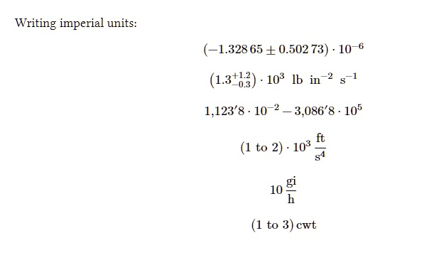

# Overview
`unify-imperial` is an inaptly-named fork of [checker's `unify` library](https://github.com/ChHecker/unify), meant for typesetting units in Typst. All `unify-imperial` does is replace metric units with imperial ones.

## Installation
[Download this repository and install it locally](https://x.com/Eager99_/status/1811625933880652259), then import it into your Typst file as shown below. At the moment I do not plan to add this package to Typst Universe.

## Examples

```typ
#import "@local/unify-imperial:0.0.2"

Writing imperial units: 
$ num("-1.32865+-0.50273e-6") $
$ qty("1.3+1.2-0.3e3", "lb/in^2/s", space: "#h(2mm)") $
$ numrange("1,1238e-2", "3,0868e5", thousandsep: "'") $
$ qtyrange("1e3", "2e3", "foot per second quarted", per: "/", delimiter: "\"to\"") $
$ qty("10", "gill per hour", per: "/") $
$ qtyrange("1", "3", "hundredweight", per: "/", delimiter: "\"to\"") $
```

